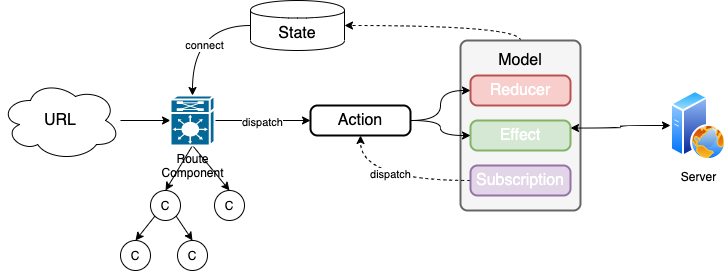

# React

> 专注于视图，进行组件化开发

- JSX和虚拟DOM
- DOM-DIFF
- 类组件
  - 状态
  - 生命周期
  - 异步更新
  - 事件合成
  - PureComponent
- 函数组件
  - hooks（实现状态、副作用）
- Context（共享上下文）
  - React.createContext() [Class]
  - React.useContext() [hooks]
- 高阶组件

## 组件

- 可以将UI切分成一些独立的、可复用的部件，这样你就只需专注于构建每一个单独的部件
- 组件从概念上类似于 JavaScript 函数。它接受任意的入参（即 “props”），并返回用于描述页面展示内容的 React 元素

### 函数组件

> 函数组件接收一个单一的`props`对象并返回了一个React元素

### 类组件

### 无状态组件

- 不依赖自身的状态(state)
- 可以是类组件或者函数组件
- 可以完全避免使用this关键字。由于使用的是箭头函数事件无需绑定。
- 有更高的性能。当不需要使用生命周期钩子时，应该首先使用无状态函数组件。
- 使用场景：组件不要管理state。

无状态组件指的是组件内部不维护state，只根据外部组件传入的props进行渲染的组件，当props改变时，组件重新渲染 有状态组件内部使用state，维护自身状态的变化，有状态组件根据外部组件传入的props和自身的state，进行渲染。

### 高阶组件（HOC - high order component）

#### 属性代理

给旧组件增加额外的属性

```jsx
const loading = loadingProps => OldComponent => {
  return (props) => {
      const extraProps = {}
      return (
        <OldComponent {...props} {...extraProps} />
      )
  }
}
```

#### 反向继承

修改React元素的生命周期和子元素, 扩展React元素功能

- 通过继承React元素调用super进行修改

### Render props

- `render prop` 是指一种在 React 组件之间使用一个值为函数的 prop 共享代码的简单技术
- 具有 render prop 的组件接受一个函数，该函数返回一个 React 元素并调用它而不是实现自己的渲染逻辑
- render prop 是一个用于告知组件需要渲染什么内容的函数 prop
- 这是一种逻辑复用方式

## 生命周期

- 旧

  

- 新

  

## React Hooks

- Hook 是 React 16.8 的新增特性，它可以让你在不编写 class 的情况下使用 state 以及其它的 React 特性

## Hooks

- useState
  - 定义状态，获得状态和改变状态的函数
- useReducer
  - useState是useReducer的语法糖，简单的使用
  - 变更状态的逻辑比较复杂的时候使用
- useCallback
  - 如果依赖的数组变化了就获得新的函数
- useMemo
  - 如果依赖的数组变化了就获得新的对象
- useContext
  - 从上下文中获取value
- useEffect & useLayoutEffect
  - 处理副作用，都在组件渲染后执行
  - useLayoutEffect 在浏览器渲染前执行
  - useEffect 在浏览器渲染后执行
  - 如果依赖项设置为空数组可作为只执行一次的函数
- useRef
  - React.forwardRef()
- useImperativeHandle
  - 使用声明式处理，可以在组件内部自定义暴露给外部的ref属性

### 自定义Hooks

- 以 `use` 开头命名的函数
- 使用了 reacthooks
- 实现逻辑的复用

## 路由

> 依赖三个核心库

- react-router
  - 路由核心库，与 DOM 无关 可以和 ReactNative Canvas DOM配合使用
  - 提供核心功能
- history
  - 不同的历史对象
  - 有不同的实现对应不同的平台
  - 实现路径的跳转和监听
- react-router-dom
  - 浏览器环境下的实现

### HashRouter

> 利用hash实现路由切换

### BrowserRouter

> h5 API 实现路由切换

### 路由工作原理

1. 收集当前的pathname，然后通过上下文向下层组件传递

2. 监听路径变化，当路径发生变化时修改pathname，然后重新渲染组件，让下层Route重新匹配

### 路由传参方式

- 路径参数
- 查询参数
- state状态

## Redux

- 解决的问题： 数据的单向流动导致两个非父子关系的组件之间通信麻烦
- 解决方案：建立一个基于发布订阅的store仓库存储数据，当数据发生变化时通知订阅方

### Redux 三大原则

- 整个应用的 state 被存储在一棵 object tree 中，并且这个 object tree 只存在唯一一个store中
- State 是只读的，唯一改变 state 的方法就是出触发 action，action 是一个用于藐视已发生事件的普通对象 使用纯函数来执行修改，为了描述action 如何改变state tree，你需要编写reducers
- 单一的数据源设计让 React 的组件之间的通信更加方便，同时也便于状态的统一管理

### Redux 中间件

***redux 是同步的执行方式*** 

- 中间件的机制可以改变数据流，实现异步操作
- 核心是改造dispatch方法

#### redux-saga

redux的异步中间件


## dva

`dva `是一个基于 `redux` 和 `redux-saga` 的数据流方案，为了简化开发体验，dva还额外内置了 `react-router` 和 `fetch` ，所以也可以理解为一个轻量级的应用框架




## 面试题

### React单向数据流的好处

- 数据流动方向可以跟踪，流动单一，追查问题的时候跟踪方便快捷。

### React怎么做数据检查和变化

- angular 有脏检查机制，Vue通过劫持对象的get、set方法，实现双向绑定
- react是单向数据流动的UI渲染框架，本身不存在数据的检测这一机制，所有的数据改变都是通过setState来手动实现的
- React本身不具备数据检查的功能(这个指向双向绑定的特点)，但是在遇到组件更新时会在`shouldCommponentUpdate`这个生命周期函数中进行数据检查相关操作(即本次更新是否返回新的状态)
- React响应数据的变化主要是通过生成新的虚拟dom，再将其映射为真实的dom树构建完成来生成新的页面
- React的数据是不可变的，通过`this.setState`或者`Hook的setState`，生成新的数据而不会去做数据检查
- 新生成的数据，生成新的虚拟dom，与旧的虚拟dom通过diff算法进行对比，然后确定需要更新的部分