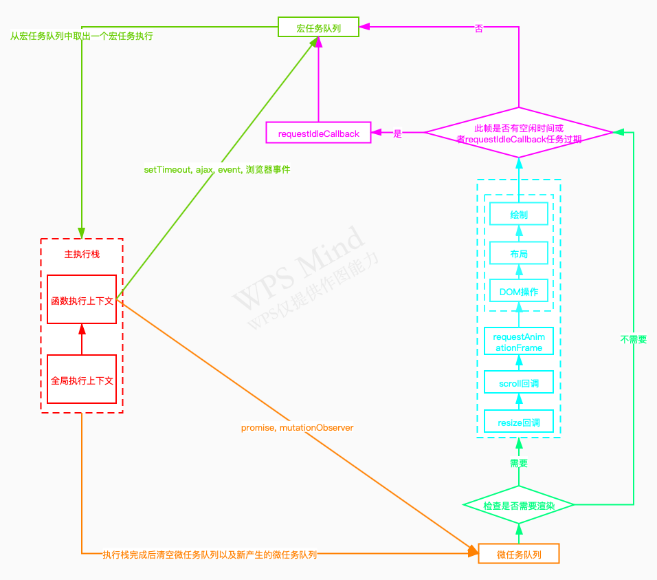

# 浏览器

> <a href="../计算机网络/computer-networks.md">加载url全过程</a> 

## 存储

### cookie

基于HTTP规范，用来识别用户，解决了HTTP的无状态问题，用来记录一些用户相关状态

cookie是服务器发送到浏览器的一小段数据，会在浏览器下次向服务器再次发起请求时被携带发送到服务器上(可以设置过期时间)

#### **缺点**

1. 大小限制在4KB左右，只能存取少量信息（使用存储空间更大的Web Storage）
2. 过多的cookie会导致请求体积增大浪费性能 (压缩cookie)

#### **属性列表**

| **属性**  |                           **作用**                           |
| :-------: | :----------------------------------------------------------: |
|   value   |                           cookie值                           |
| http-only |               不允许JS访问cookie，防止XSS攻击                |
|  secure   |            只允许在协议为HTTPS的请求中携带cookie             |
| same-site | Lax(默认)：允许与第三方的get请求一起发送 Strict: 不允许与第三方请求一起发送 None: 任何请求都会携带 |

`same-site` 有效防止了 XSRF 攻击

### Web Storage(5M左右)

#### **local Storage**

数据可以长期保留，需要用户手动删除

#### **session Storage**

页面关闭时数据会被清除

### indexedDB

事务型数据库

## 安全

### XSS攻击(跨站脚本攻击)

> `XSS`全称是`Cross Site Scripting[跨站脚本]`，为了和css区分，故叫它`xss`。XSS攻击是指浏览器中执行恶意脚本(无论是跨域还是同域)，从而拿到用户的信息进行操作

- 危害：
  - 窃取Cookie
  - 监听用户行为，比如输入账号密码后直接发送到黑客服务器
  - 修改DOM伪造登录表单
  - 在页面中生成浮窗广告

- 原理：用户输入的数据出现在代码中成为脚本
- 类型
  - 反射型： url注入，恶意脚本作为网络请求的一部分，发送该url给别人(可生成短链接伪装)
  - 存储型：脚本注入到数据库中，再次被渲染到页面中
  - 文档型：文档型的XSS攻击并不会经过服务端，而是作为中间人的角色，在数据传输过程劫持到网络数据包，然后修改里面的html文档 这样的劫持方式包括`wifi路由劫持`或者`本地恶意软件`等
- 防范：阻止用户输入的内容形成脚本，阻止恶意脚本执行
  - 浏览器提供：设置HTTP头 `X-XSS-Protection`, 用户输入内容再次出现在HTML中时会进行拦截(在html词法分析后进行)
  - 转义
  - 黑白名单：针对富文本
  - CSP(内容安全策略): 通过HTTP头限制某些内容的执行
  - HttpOnly：很多XSS攻击脚本都是用来窃取Cookie，而设置Cookie的HttpOnly属性后，JavaScript便无法读取Cookie的值

### CSRF(跨站请求伪造)

- 原理：浏览器请求会携带cookie信息，利用cookie信息上的登录态伪装用户操作
- 防范
  - 由于是利用cookie的信息，只要不发送cookie就好了，设置 `same-site` 限制cookie发送条件
  - CSRF攻击直接访问后端接口，不经过前端，只要在前端站点设置判断信息传送给后端校验(自定义校验信息Token、Origin或者referer)。其中，Origin只包含域名信息，而Referer包含了具体的 URL 路径。 当然，这两者都是可以伪造的，通过 Ajax 中自定义请求头即可，安全性略差。

### 点击劫持

- 利用 frame 引用页面 设置 opacity 为 0 让用户不可见
- 引导用户操作不可见页面例如虚假按钮

## 缓存

### 强制缓存

- `cache-control: max-age=time` 设置缓存时间
- `Expire: Date` 设置过期时间

### 协商缓存(对比缓存)

- 对比时间
  - 服务端设置头 `Last-Modified`
  - 客户端返回 `if-modified-since`
  - 缺点
    1. 秒级内的修改不会改变修改时间导致内容无法实时更新
    2. 为对文件内容进行修改只进行保存操作会修改时间，导致缓存失效
- 对比标记(计算hash)
  - 服务端设置头 `Etag`
  - 客户端返回 `if-None-Match`

## 跨域

### CORS(跨域资源共享)

- 使用额外的HTTP头允许Web应用访问该服器上的指定资源
- 复杂请求需要额外设置更多的请求头，并且会发出一次预检请求(OPTIONS)
- 优点
  - 支持多种请求方式
  - 使用AJAX监听，有更好的错误处理能力
- 缺点
  - 兼容性(也不是很差)

### JSONP

- 利用浏览器 `script` 标签的跨域能力
- 优点
  - 兼容性好
- 缺点
  - 只支持get请求
  - XSS攻击风险大
- 方式
  1. 前端定义解析函数
  2. 在请求中声明解析函数
  3. 后端获取函数声明，以带参执行的形式传递给前端
  4. 前端执行了解析函数，函数内的参数就是服务端传入的值

### http-proxy(代理)

- 正向代理：利用服务端请求无跨域问题，架一层中间层，由该层代替请求其他域下的内容
- Nginx反向代理
  1. 浏览器请求nginx服务
  2. nginx服务去请求html
  3. 外部资源路径以`/XXX` 的形式都是以nginx域发出的请求
  4. nginx再去请求其他域的接口返回

- WebSocket：无跨域限制
- window.postMessage()：浏览器提供的跨页面通信方案

### 基于iframe的各种方案

- window.name: iframe的window.name 上的属性不会随着src的改变而消失
- Location.hash
- document.domain: 解决二级或三级域名不同情况下的跨域问题

## 渲染原理

### 渲染过程

- 解析HTML构建DOM树
  - 注释会在DOM树中
  - 空白符会在DOM树中

- 遇到CSS时解析CSS构建CSSOM树
  - css解析与DOM解析同时进行
- DOM树和CSSOM树构建完后基于这两棵树构建渲染树(Render Tree)
  - 浏览器从DOM树的根节点开始遍历每个 **可见节点** ，然后去查找适配的CSS规则并运用
  - `display: none;` 的元素不在渲染树中，`visibility:hidden;` 的元素在渲染树中
- 通过遍历渲染树读取样式信息进行布局
  - `float` `absolute` `fixed` 会发生位置偏移
  - 脱离文档流就是脱离渲染树
- 绘制渲染树

### 渲染性能

##### 阻塞

- JS有调用DOM和CSSOM树接口并对其修改的能力，所以在解析到 `<script>` 标签时，会暂停DOM构建，直至脚本加载执行完
  - `script` 的 `async` 属性，可以让外部脚本异步加载，不阻塞HTML解析
  - `script` 的 `defer` 属性，延迟脚本执行直到页面加载
- 如果JS操作了CSSOM，而CSSOM还没下载和构建会等待CSSOM的下载和构建同时阻塞了DOM构建
  - CSS脚本放头部防止 **渲染阻塞** 
  - JS脚本放底部或者设置 `async` 或 `defer` 属性

##### 重绘和回流

回流必定引起重绘，重绘不一定回流

- 回流：浏览器布局发生变化 + 获取元素的某些属性(浏览器为了确保获取属性的正确性会触发回流) + `resize` 和 `scroll` 时修改字体大小(防抖、节流)
- 重绘：不影响布局的部分发生改变(如颜色)
- 优化
  - 用 `transform` 做形变和位移可以减少回流
  - 尽量一次性修改节点样式(利用class)
  - 使用 `DocumentFragment` 将要多次修改的DOM存入内存，最后一次性 `append` 到DOM树中(或用于大量节点的插入)
  - 将要多次修改的DOM元素设置 `display:none;` 让其从渲染树中脱离，修改完成后再显示回渲染树中
  - 避免多次读取回引发回流的属性(例如 `offsetLeft` `scrollTop` `width` 等) 
  - 将复杂节点脱离文档流，形成新的渲染层，降低回流成本

## 事件环

- queueMicrotask: 添加一个微任务

## V8

### <a href="./V8/垃圾收集/note.md">垃圾回收</a> 